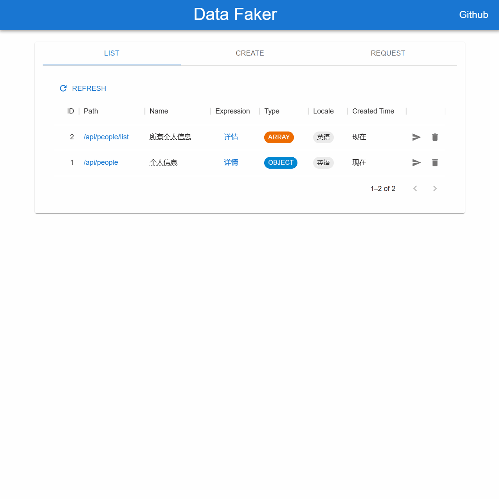

# Data Faker

快速构建灵活的 Fake Data RESTful API，基于 JDK17、[DataFaker](https://www.datafaker.net/)、[Vert.X](https://vertx.io/) 和 [MUI](https://mui.com/) 构建。

- 支持创建 JSON Object 类型和 Array 类型 的 Restful API
- 数组数据接口支持 `limit` 参数
- 支持丰富的数据类型（详细可参见 [DataFaker 的 Providers](https://www.datafaker.net/documentation/providers/)）
- 支持多语言，比如英语en、中文zh_CN、韩文ko、日文ja
- 支持接口延时配置
- 支持前端控制台管理

## 启动

1. 克隆项目到本地
2. 执行 `mvn exec:java -f .\data-faker\pom.xml` 启动服务
3. 浏览器打开 `http://127.0.0.1:9000` 使用前端控制台
4. 前端部分请看 [frontend/readme](./frontend/readme.md)

> 后端默认静态路径使用 `frontend/build`

## 文档

See [Rest Data Faker Docs](https://onemsg.github.io/data-faker/)

## 后续规划

- Fake JsonObject 支持 JsonArray 字段类型
- 支持 Native Image

## 更新记录

- 2023-02-14 - 增加接口延时支持
- 2023-01-15 - 增加前端控制台
- 2022-10-19 - Fake data 支持自定义语言选项

## 反馈

欢迎提 issue.