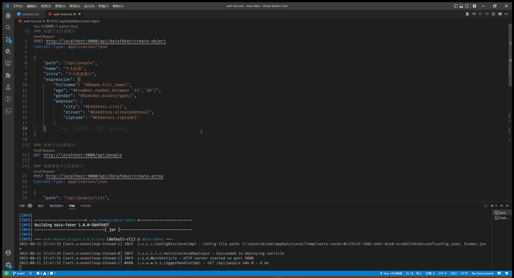

# Data Faker

快速构建灵活的 Fake Data RESTful API，基于 JDK17、[datafaker](https://www.datafaker.net/) 和 [vert.x](https://vertx.io/) 开发。



## 启动

1. 克隆项目到本地
2. 执行 `mvn exec:java -f .\data-faker\pom.xml` 启动服务

## API使用

### 创建 `JsonObject` 格式数据

```
POST http://localhost:9000/api/datafaker/create-object  
Content-Type: application/json

{
    "path": "/api/people",  // 请保证路径 /api 开头
    "name": "个人信息",
    "intro": "个人信息接口",
    "expression": {
        "fullname": "#{Name.full_name}", 
        "age": "#{number.number_between '15','50'}",
        "gender": "#{Gender.binaryTypes}",
        "address": {
            "city": "#{Address.city}",
            "street": "#{Address.streetAddress}",
            "zipCode": "#{Address.zipCode}"
        }
    }
}
```
返回 `201`

请求 `GET http://localhost:9000/api/people` 会返回

```json
{
  "fullname": "韩昊强",
  "age": 47,
  "gender": "Male",
  "address": {
    "city": "蓬莱",
    "street": "严街065号",
    "zipCode": 904910
  }
}
```

### 创建 `JsonArray` 格式数据

```
POST http://localhost:9000/api/datafaker/create-array
Content-Type: application/json

{
    "path": "/api/people/list", // 请保证路径 /api 开头
    "name": "所有个人信息",
    "intro": "所有个人信息接口",
    "expression": {
        "fullname": "#{Name.full_name}", 
        "age": "#{number.number_between '15','50'}",
        "gender": "#{Gender.binaryTypes}",
        "address": {
            "city": "#{Address.city}",
            "street": "#{Address.streetAddress}",
            "zipCode": "#{Address.zipCode}"
        }
    }
}
```
返回 `201`

请求 `GET http://localhost:9000/api/people/list?limit=1` 会返回

```json
[
  {
    "fullname": "夏文轩",
    "age": 17,
    "gender": "Female",
    "address": {
      "city": "沈阳",
      "street": "蔡侬39991号",
      "zipCode": 476397
    }
  }
]
```

### 查看已创建接口

```
GET http://localhost:9000/api/datafaker/list
```

返回 `200`

```json
[
  {
    "id": 6,
    "path": "/api/people/list",
    "name": "所有个人信息",
    "intro": "所有个人信息接口",
    "expression": {
      "fullname": "#{Name.full_name}",
      "age": "#{number.number_between '15','50'}",
      "gender": "#{Gender.binaryTypes}",
      "address": {
        "city": "#{Address.city}",
        "street": "#{Address.streetAddress}",
        "zipCode": "#{Address.zipCode}"
      }
    },
    "type": "ARRAY",
    "createdTime": "2022-08-11T22:16:41.6263039"
  },
  {
    "id": 5,
    "path": "/api/people",
    "name": "个人信息",
    "intro": "个人信息接口",
    "expression": {
      "fullname": "#{Name.full_name}",
      "age": "#{number.number_between '15','50'}",
      "gender": "#{Gender.binaryTypes}",
      "address": {
        "city": "#{Address.city}",
        "street": "#{Address.streetAddress}",
        "zipCode": "#{Address.zipCode}"
      }
    },
    "type": "OBJECT",
    "createdTime": "2022-08-11T22:13:17.4111089"
  }
]
```

### 请求 Fake Data 接口

```
GET http://localhost:9000/{自定义数据路径}
```
返回 `expression` 定义的数据

> 请求参数 `limit` 仅对 `JsonArray` 有效

### 测试 datafaker 表达式 

```
http://localhost:9000/api/datafaker/test-expression?text=%23{Name.full_name}
```

> `#` 符号请用 `%23` 代替

## 后续规划

- Fake data 支持自定义语言选项
- Fake JsonObject 支持 JsonArray 字段类型
- 使用 [MUI](https://mui.com/zh/) 构建前端平台
- 打包成 Native Image，可通过命令行启动
